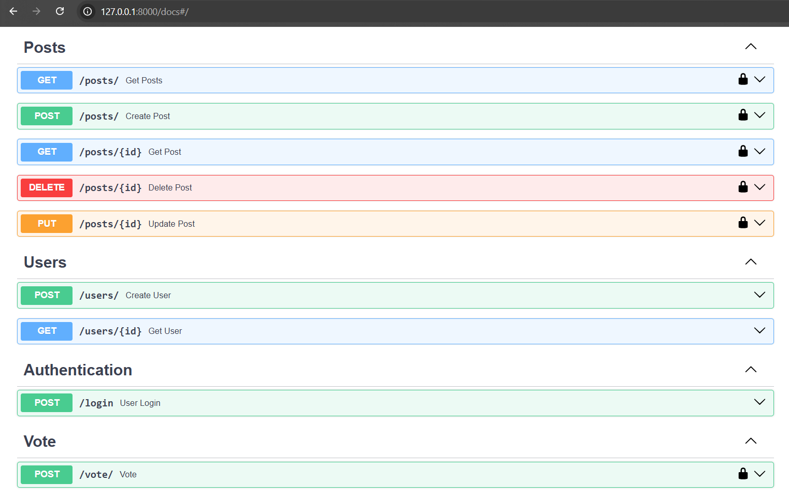
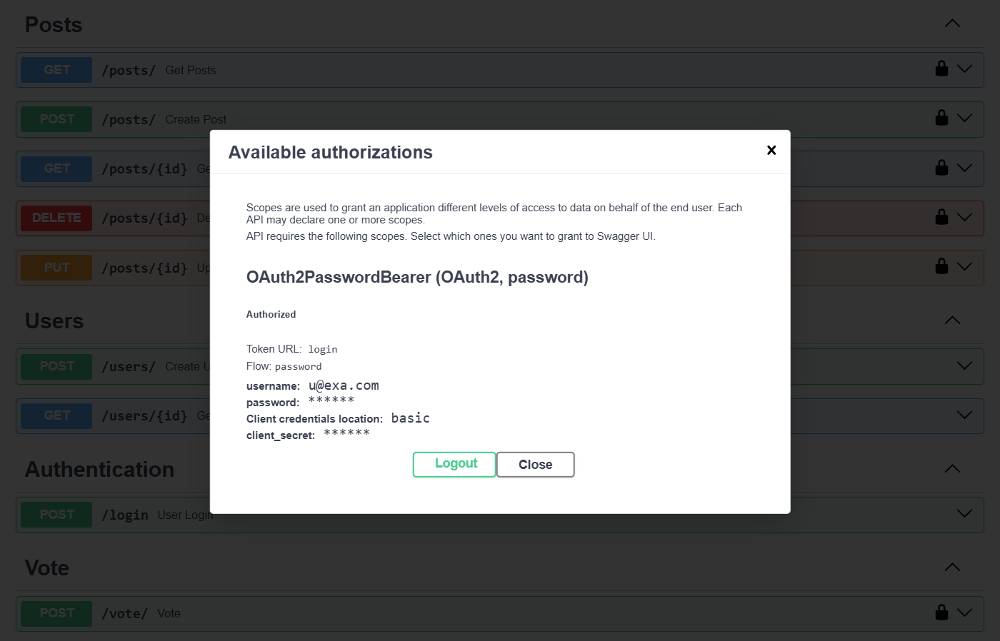
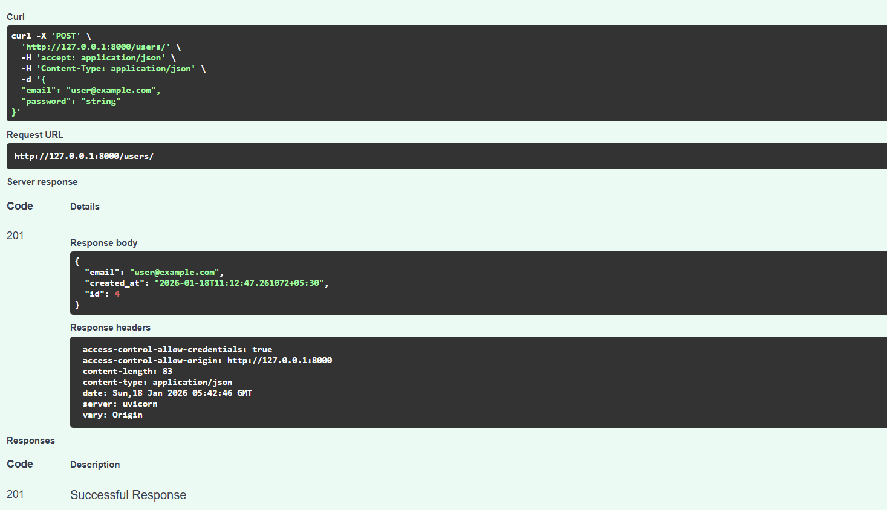

# Social Media Backend API (FastAPI)

A **production-style social media backend** built using **FastAPI**, designed with clean architecture, real-world authentication, and scalable database modeling.
---

## 🧠 Core Features

- User Registration & Login
- Secure Authentication using **OAuth2 + JWT**
- Create, Read, Update, Delete (CRUD) Posts
- Fetch Posts by Individual Users
- Voting / Like System on Posts
- Prevent Duplicate Votes (User ↔ Post constraint)
- Modular API structure using **APIRouters**
- Strong request & response validation using **Pydantic Schemas**
- Data Migrations through **Alembic**
- CORS support using fastapi **CORSMiddleware**
- Password Hashing
- Query Parameters

---

## 📘 API Documentation (Swagger UI)

Below are screenshots from FastAPI’s Swagger UI showing secured and functional endpoints.

### 🔹 API Endpoints Overview

### 🔹 JWT Authentication (Authorized)

### 🔹 Request & Response Example

## API Endpoints Overview
- POST /users – Register user
- POST /login – User authentication
- POST /posts – Create post
- GET /posts – Fetch all posts
- GET /posts/{id} – Fetch single post
- PUT /posts/{id} – Update post
- DELETE /posts/{id} – Delete post
- POST /vote – Vote/Unvote post

## 🛠️ Tech Stack

- **Framework:** FastAPI  
- **Language:** Python  
- **Database:** PostgreSQL  
- **ORM:** SQLAlchemy  
- **Validation:** Pydantic  
- **Authentication:** OAuth2 + JWT  
- **API Architecture:** RESTful APIs  
- **Tools:** Postman, Uvicorn  

---

## 🗂️ Database Design

Three well-structured relational tables:

- **Users**
- **Posts**
- **Votes** (Many-to-Many relationship between Users & Posts)

Designed with proper **foreign keys, constraints, and relationships** to ensure data integrity.

---

## 🧱 Architecture Highlights

- Clean separation of:
  - Models
  - Schemas
  - Routers
  - Authentication logic
- Scalable project structure suitable for:
  - Startup backends
  - SaaS products
  - MVPs

---

## Ongoing Improvements

- Pagination & advanced filtering   
- API performance optimization  
- Deployment (Docker + Cloud)  
- Rate limiting & security hardening  

---

